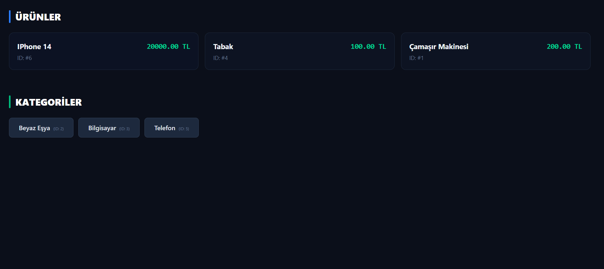

# 🛍️ Django E-Ticaret REST API

> Modern, ölçeklenebilir ve güvenli bir e-ticaret backend sistemi — Django REST Framework ile geliştirilmiştir.



---

## 📋 İçindekiler

| Bölüm | Açıklama |
|---|---|
| [✨ Özellikler](#-özellikler) | Sistemin sunduğu tüm özellikler |
| [🛠 Teknolojiler](#-teknolojiler) | Kullanılan kütüphane ve araçlar |
| [📦 Kurulum](#-kurulum) | Yerel geliştirme ortamı kurulumu |
| [📖 API Dokümantasyonu](#-api-dokümantasyonu) | Swagger & Endpoint referansı |
| [📁 Proje Yapısı](#-proje-yapısı) | Dizin ve dosya ağacı |
| [🔧 Kullanım](#-kullanım) | Örnek istek ve yanıtlar |
| [🔒 Güvenlik](#-güvenlik) | Rate limiting, CORS ve ortam değişkenleri |
| [🚀 Production Deployment](#-production-deployment) | Canlı ortama geçiş rehberi |
| [🎨 Frontend Entegrasyonu](#-frontend-entegrasyonu) | React frontend bağlantısı |

---

## ✨ Özellikler

<table>
<tr>
<td>

**🔐 Kimlik Doğrulama**
- JWT (Access + Refresh token)
- Access token: 1 saat
- Refresh token: 7 gün
- Rol bazlı yetkilendirme (Admin / User)
- API Key authentication

</td>
<td>

**🛒 Alışveriş**
- Ürün katalog yönetimi (CRUD)
- Kategori bazlı filtreleme
- Gelişmiş arama & sıralama
- Ürün görselleri yönetimi
- Sepet & sipariş sistemi
- İndirim kuponu desteği

</td>
</tr>
<tr>
<td>

**💳 Ödeme**
- İyzico entegrasyonu
- Güvenli ödeme akışı
- Sandbox & production modu

</td>
<td>

**🚀 Performans & Güvenlik**
- Rate limiting & throttling
- CORS yapılandırması
- Sayfalama (pagination)
- Detaylı loglama sistemi
- Özel hata yönetimi

</td>
</tr>
<tr>
<td colspan="2">

**📚 Dokümantasyon**
- Swagger UI & ReDoc entegrasyonu
- OpenAPI 3.0 otomatik schema

</td>
</tr>
</table>

---

## 🛠 Teknolojiler

| Kategori | Paket | Versiyon |
|---|---|---|
| **Web Framework** | Django | 5.2.3 |
| **REST API** | Django REST Framework | 3.16.1 |
| **Authentication** | djangorestframework-simplejwt | 5.5.1 |
| **API Docs** | drf-spectacular | 0.29.0 |
| **Filtreleme** | django-filter | 25.2 |
| **Ödeme** | iyzipay | 1.0.46 |
| **API Key** | djangorestframework-api-key | 2.3.0 |
| **CORS** | django-cors-headers | 4.9.0 |
| **Görsel** | Pillow | 12.1.1 |
| **Veritabanı** | SQLite3 *(dev)* / PostgreSQL *(prod)* | — |

---

## 📦 Kurulum

### Ön Gereksinimler

- Python **3.10** veya üzeri
- `pip` paket yöneticisi
- Virtual environment (önerilir)

### Adım Adım Kurulum

**1. Projeyi klonlayın**
```bash
git clone <repository-url>
cd django-api
```

**2. Virtual environment oluşturun ve aktive edin**
```bash
# Windows
python -m venv .venv
.venv\Scripts\activate

# Linux / macOS
python3 -m venv .venv
source .venv/bin/activate
```

**3. Bağımlılıkları yükleyin**
```bash
pip install -r requirements.txt
```

**4. Veritabanı migrasyonlarını uygulayın**
```bash
python manage.py makemigrations
python manage.py migrate
```

**5. Superuser oluşturun**
```bash
python manage.py createsuperuser
```

**6. Static dosyaları toplayın**
```bash
python manage.py collectstatic --noinput
```

**7. Sunucuyu başlatın**
```bash
python manage.py runserver
```

Uygulama `http://127.0.0.1:8000/` adresinde çalışacaktır.

---

## 📖 API Dokümantasyonu

Canlı Swagger dokümantasyonuna tarayıcıdan erişebilirsiniz:

| Arayüz | URL |
|---|---|
| **Swagger UI** | [`/api/docs`](https://batuhanyilmaz1.pythonanywhere.com/api/docs) |
| **ReDoc** | `/api/redoc` |
| **OpenAPI Schema** | `/api/schema` |

---

<<<<<<< HEAD
## 📁 Proje Yapısı

```
django-api/
├── 📁 app/                      # Ana proje ayarları
│   ├── settings.py              # Django ayarları
│   ├── urls.py                  # Ana URL yapılandırması
│   ├── throttles.py             # Rate limiting ayarları
│   └── wsgi.py                  # WSGI yapılandırması
│
├── 📁 users/                    # Kullanıcı yönetimi
├── 📁 products/                 # Ürün yönetimi
├── 📁 categories/               # Kategori yönetimi
├── 📁 cards/                    # Sepet yönetimi
├── 📁 orders/                   # Sipariş yönetimi
├── 📁 comments/                 # Yorum sistemi
├── 📁 addresses/                # Adres yönetimi
├── 📁 coupons/                  # Kupon sistemi
├── 📁 payments/                 # Ödeme sistemi
│
├── 📁 core/                     # Ortak araçlar
│   ├── paginations.py           # Sayfalama ayarları
│   ├── permissions.py           # Özel izin sınıfları
│   ├── exceptions.py            # Özel hata yönetimi
│   └── utils.py                 # Yardımcı fonksiyonlar
│
├── 📁 media/product_images/     # Yüklenen ürün görselleri
├── 📁 staticfiles/              # Static dosyalar
├── 📁 logs/django.log           # Uygulama logları
│
├── db.sqlite3                   # SQLite veritabanı
├── manage.py                    # Django yönetim komutları
├── requirements.txt             # Python bağımlılıkları
└── README.md                    # Bu dosya
```

Her uygulama klasörü standart olarak şu dosyaları içerir:
`models.py` · `serializers.py` · `views.py` · `urls.py` · `services.py`

---

=======
>>>>>>> c6b67018dd772e625a25216421e537e5b894bd51
## 🔧 Kullanım

### Kimlik Doğrulama

<details>
<summary><strong>Kullanıcı Kaydı</strong> — <code>POST /api/users/register/</code></summary>

```json
{
    "username": "kullanici_adi",
    "email": "email@example.com",
    "password": "güçlü_şifre",
    "password2": "güçlü_şifre",
    "first_name": "Ad",
    "last_name": "Soyad"
}
```
</details>

<details>
<summary><strong>Giriş Yapma</strong> — <code>POST /api/users/login/</code></summary>

**İstek:**
```json
{
    "username": "kullanici_adi",
    "password": "güçlü_şifre"
}
```

**Yanıt:**
```json
{
    "message": "Login successfull",
    "token": {
        "access": "eyJ0eXAiOiJKV1QiLCJhbGc...",
        "refresh": "eyJ0eXAiOiJKV1QiLCJhbGc..."
    },
    "user": {
        "id": 1,
        "email": "user@example.com",
        "first_name": "John",
        "last_name": "Doe",
        "role": "user"
    }
}
```
</details>

<details>
<summary><strong>Token Yenileme</strong> — <code>POST /api/users/token/refresh/</code></summary>

```json
{
    "refresh": "eyJ0eXAiOiJKV1QiLCJhbGc..."
}
```
</details>

---

### Endpoint Referansı

#### Ürünler

| Metod | Endpoint | Yetki | Açıklama |
|---|---|---|---|
| `GET` | `/api/products/` | Herkese açık | Ürün listesi (filtre + arama) |
| `GET` | `/api/products/{slug}/` | Herkese açık | Ürün detayı |
| `POST` | `/api/products/admin/create/` | Admin | Ürün oluşturma |
| `PUT` | `/api/products/admin/{id}/` | Admin | Ürün güncelleme |
| `DELETE` | `/api/products/admin/{id}/` | Admin | Ürün silme |
| `POST` | `/api/products/admin/{id}/images/` | Admin | Görsel yükleme |

#### Sepet

| Metod | Endpoint | Yetki | Açıklama |
|---|---|---|---|
| `GET` | `/api/cart/` | Kullanıcı | Sepeti görüntüle |
| `POST` | `/api/cart/add/` | Kullanıcı | Sepete ürün ekle |
| `PUT` | `/api/cart/items/{item_id}/` | Kullanıcı | Ürün miktarını güncelle |
| `DELETE` | `/api/cart/items/{item_id}/` | Kullanıcı | Ürünü sepetten çıkar |

#### Siparişler

| Metod | Endpoint | Yetki | Açıklama |
|---|---|---|---|
| `GET` | `/api/orders/` | Kullanıcı | Siparişleri listele |
| `POST` | `/api/orders/create/` | Kullanıcı | Sipariş oluştur |
| `GET` | `/api/orders/{id}/` | Kullanıcı | Sipariş detayı |

#### Yorumlar

| Metod | Endpoint | Yetki | Açıklama |
|---|---|---|---|
| `GET` | `/api/comments/` | Herkese açık | Yorumları listele |
| `POST` | `/api/comments/create/` | Kullanıcı | Yorum ekle |
| `DELETE` | `/api/comments/{id}/` | Kullanıcı / Admin | Yorum sil |

<details>
<summary><strong>Sipariş oluşturma — örnek istek</strong></summary>

```json
// POST /api/orders/create/
{
    "delivery_address": 1,
    "billing_address": 1,
    "coupon_code": "INDIRIM20"
}
```
</details>

<details>
<summary><strong>Yorum ekleme — örnek istek</strong></summary>

```json
// POST /api/comments/create/
{
    "product": 1,
    "text": "Harika bir ürün!",
    "rating": 5
}
```
</details>

---

## 🔒 Güvenlik

### Rate Limiting

| Kullanıcı Tipi | Min. İstek / Gün | Maks. İstek / Gün |
|---|---|---|
| Anonim | 25 | 50 |
| Kimlikli | 50 | 100 |

### CORS

Geliştirme ortamında tüm origin'lere izin verilir. Production için:

```python
# settings.py
CORS_ALLOWED_ORIGINS = [
    "https://yourdomain.com",
    "https://www.yourdomain.com",
]
```

### Ortam Değişkenleri

```python
# settings.py — production ayarları
DEBUG = False
SECRET_KEY = "production-secret-key"
ALLOWED_HOSTS = ["yourdomain.com"]

IYZICO_API_KEY    = "your-production-api-key"
IYZICO_SECRET_KEY = "your-production-secret-key"
IYZICO_BASE_URL   = "api.iyzipay.com"
```

### Loglama

Loglar `logs/django.log` dosyasında saklanır:

| Seviye | Açıklama |
|---|---|
| `INFO` | Genel bilgi mesajları |
| `WARNING` | Uyarılar |
| `ERROR` | Hatalar |
| `CRITICAL` | Kritik hatalar |

---

## 🧪 Test

```bash
# Tüm testleri çalıştır
python manage.py test

# Belirli bir uygulama için
python manage.py test products
```

---

## 🚀 Production Deployment

```python
# 1. Debug modunu kapat
DEBUG = False

# 2. Güçlü secret key üret
import secrets
SECRET_KEY = secrets.token_urlsafe(50)

# 3. PostgreSQL yapılandır
DATABASES = {
    "default": {
        "ENGINE": "django.db.backends.postgresql",
        "NAME": "your_db_name",
        "USER": "your_db_user",
        "PASSWORD": "your_db_password",
        "HOST": "localhost",
        "PORT": "5432",
    }
}

# 4. HTTPS güvenlik ayarları
SECURE_SSL_REDIRECT = True
SESSION_COOKIE_SECURE = True
CSRF_COOKIE_SECURE = True
```

```bash
# 5. Static dosyaları topla
python manage.py collectstatic
```

---

## 🎨 Frontend Entegrasyonu

Bu proje **React** tabanlı bir frontend ile entegre edilmiştir.
Detaylar için: [`FRONTEND/frontend_for_website/README_INTEGRATION.md`](./FRONTEND/frontend_for_website/README_INTEGRATION.md)

### Tamamlanan Entegrasyonlar

| Alan | Durum |
|---|---|
| API Service Katmanı (tüm endpoint'ler) | ✅ |
| Otomatik JWT token yenileme | ✅ |
| Request / Response interceptors | ✅ |
| Gelişmiş hata yönetimi | ✅ |
| JWT kimlik doğrulama | ✅ |
| Persistent auth (localStorage) | ✅ |
| Admin / User rol yönetimi | ✅ |
| Login & Register sayfaları | ✅ |
| Ürün listesi (filtreleme + sıralama) | ✅ |
| Ürün detay sayfası | ✅ |
| Sepet sayfası | ⏳ Backend hazır |
| Checkout sayfası | ⏳ Backend hazır |
| Kullanıcı paneli | ⏳ Backend hazır |

### Düzeltilen Endpoint Eşleşmeleri

```
❌ /auth/register  →  ✅ /api/users/signup
❌ /auth/login     →  ✅ /api/users/login
❌ /cart/*         →  ✅ /api/cards/*
```

### Frontend Kurulum

```bash
cd FRONTEND/frontend_for_website
npm install
npm start
```

```env
# .env
REACT_APP_BACKEND_URL=http://localhost:8000
```

### Kullanım Örnekleri

<details>
<summary><strong>Authentication (useAuth hook)</strong></summary>

```javascript
import { useAuth } from '@/context/AuthContext';

const { login, register, user } = useAuth();

await register({
  first_name: 'John',
  last_name: 'Doe',
  email: 'john@example.com',
  phone: '05551234567',
  password: 'SecurePass123',
  password2: 'SecurePass123'
});

await login('john@example.com', 'SecurePass123');
```
</details>

<details>
<summary><strong>Sepet İşlemleri (useCart hook)</strong></summary>

```javascript
import { useCart } from '@/context/CartContext';

const { addToCart, cart, cartCount } = useCart();

await addToCart(productId, 2);
console.log(cartCount); // 2
```
</details>

<details>
<summary><strong>API Servisleri</strong></summary>

```javascript
import { productService, categoryService } from '@/lib/api';

const products = await productService.getAll({
  category: 1,
  sort_by: 'price_asc',
  min_price: 100,
  max_price: 500,
  in_stock: true
});

const categories = await categoryService.getAll();
```
</details>

### Backend İyileştirme Gereksinimleri

Frontend'in tam performans gösterebilmesi için gerekli değişiklikler:
[`FRONTEND/frontend_for_website/BACKEND_CHANGES_REQUIRED.md`](./FRONTEND/frontend_for_website/BACKEND_CHANGES_REQUIRED.md)

| Alan | Gerekli Değişiklik |
|---|---|
| Product model | `original_price`, `featured`, `created_at` alanları |
| Category model | `slug`, `image` alanları |
| Serializers | `category_name`, `category_id`, `product_count`, `images[].url` |
| Product filtering | `featured`, `category`, `price_range`, `in_stock`, `search` |
| Response format | Standartlaştırma |

---

<<<<<<< HEAD
## 🤝 Katkıda Bulunma

1. Bu repoyu **fork** yapın
2. Yeni bir feature branch oluşturun: `git checkout -b feature/amazing-feature`
3. Değişikliklerinizi commit edin: `git commit -m 'feat: add amazing feature'`
4. Branch'inizi push edin: `git push origin feature/amazing-feature`
5. **Pull Request** açın

---

## 📞 İletişim & Lisans

📧 [batuhanyilmaz0011@gmail.com](mailto:batuhanyilmaz0011@gmail.com)

Bu proje **MIT lisansı** altında lisanslanmıştır.

> **Not:** Bu proje eğitim amaçlı geliştirilmiştir. Production ortamında kullanmadan önce güvenlik testlerini yapın ve gerekli optimizasyonları uygulayın.
=======
**Not:** Bu proje eğitim amaçlı geliştirilmiştir. Production ortamında kullanmadan önce güvenlik testlerini yapın ve gerekli optimizasyonları uygulayın.
>>>>>>> c6b67018dd772e625a25216421e537e5b894bd51
